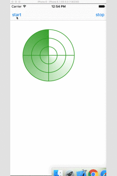

# LLRadarView

最近看到有好多app上都集成了雷达扫描视图，对此做了一个简单的封装，Demo样式如下:



使用方法很简单，如下所示:
```
// 初始化雷达视图
self.radarView = [[LLRadarView alloc] initWithFrame:CGRectMake(50, 100, 200, 200)];
// 设置显示中间十字线
_radarView.showCrossline = YES;
// 设置需要闪烁动画
_radarView.needOpacityAnimation = YES;
[self.view addSubview:_radarView];   
```

```
// 开始动画
[_radarView startAnimation];
// 结束动画
[_radarView stopAnimation];
```

.h文件如下，可以设置的属性都在这里：
```
@interface LLRadarView : UIView

// 雷达蒙层颜色
@property (nonatomic, strong) UIColor *alphaColor;

// 圆环个数
@property (nonatomic, assign) NSInteger circleCount;

// 圆环颜色
@property (nonatomic, strong) UIColor *circleColor;

// 圆环宽度
@property (nonatomic, assign) CGFloat circleWidth;

// 是否显示中间的十字
@property (nonatomic, assign) BOOL showCrossline;

// 十字颜色
@property (nonatomic, strong) UIColor *crosslineColor;

// 十字的宽度
@property (nonatomic, assign) CGFloat crosslineWidth;

// 雷达蒙层每转一圈的时间
@property (nonatomic, assign) NSTimeInterval duration;

// 是否需要闪烁动画
@property (nonatomic, assign) BOOL needOpacityAnimation;

// 闪烁点的颜色
@property (nonatomic, strong) UIColor *pointColor;

// 闪烁点的半径
@property (nonatomic, assign) CGFloat pointRadius;

// 开始动画
- (void)startAnimation;

// 停止动画
- (void)stopAnimation;

@end
```

如果你喜欢这个Demo，请给个star奥，谢谢大家 😊 !!!